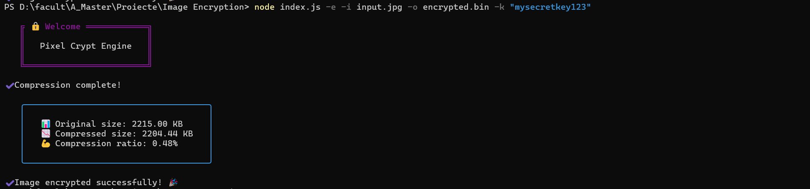
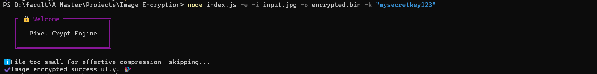
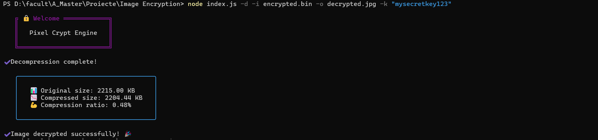

# Pixel Crypt Engine Documentation

## Table of Contents
1. [Project Overview](#project-overview)
2. [Installation](#installation)
3. [Usage](#usage)
4. [Technical Implementation](#technical-implementation)
5. [Examples](#examples)

## Project Overview📝
Pixel Crypt Engine is a Node.js-based command-line tool that provides secure image encryption and decryption capabilities. It uses AES-256-CTR encryption combined with smart GZIP compression (for files >10KB) to securely store and transfer image files. The tool features progress tracking, compression statistics, and a user-friendly CLI interface.

## Installation⚙️
To install and use Pixel Crypt Engine:

1. Clone the repository:
```bash
git clone https://github.com/RobCyberLab/pixel-crypt-engine.git
```

2. Install dependencies:
```bash
npm install
```

3. Make CLI executable:
```bash
chmod +x index.js
```

## Usage📖
The engine provides two main operations:

### Image Encryption
Encrypt an image with smart compression:
```bash
node index.js -e -i input.jpg -o encrypted.bin -k "your-secret-key"
```

### Image Decryption
Decrypt an encrypted file:
```bash
node index.js -d -i encrypted.bin -o decrypted.jpg -k "your-secret-key"
```

### Available Options
```bash
Options
  -e, --encrypt    Encrypt an image
  -d, --decrypt    Decrypt an image
  -i, --input      Path to input image
  -o, --output     Save encrypted/decrypted image to
  -k, --key        Secret key for encryption/decryption
  -c, --compress   Enable smart compression for files >10KB (default: true)
```

## Technical Implementation🔐
Key technical features:

### Smart Compression Process
```javascript
const MIN_COMPRESS_SIZE = 10240; // 10KB minimum for compression

async function encrypt({ input, output, key, compress }) {
    // ...
    if (compress && imageData.length > MIN_COMPRESS_SIZE) {
        spinner.text = 'Compressing image...';
        processedData = await gzip(imageData);
        spinner.succeed('Compression complete!');
        showStats(imageData.length, processedData.length);
    } else if (compress) {
        spinner.info('File too small for effective compression, skipping...');
        compress = false;
    }
    // ...
}
```

### Encryption Process
```javascript
const algorithm = 'aes-256-ctr';
const iv = crypto.randomBytes(16);
const cipher = crypto.createCipheriv(algorithm, key.padEnd(32).slice(0, 32), iv);

const encryptedImage = Buffer.concat([
    iv,
    Buffer.from([compress ? 1 : 0]),
    cipher.update(processedData),
    cipher.final()
]);
```

### Statistics Display
```javascript
function showStats(originalSize, compressedSize) {
    const ratio = ((1 - compressedSize / originalSize) * 100).toFixed(2);
    console.log(boxen([
        `📊 Original size: ${(originalSize / 1024).toFixed(2)} KB`,
        `📉 Compressed size: ${(compressedSize / 1024).toFixed(2)} KB`,
        `💪 Compression ratio: ${ratio}%`
    ].join('\n')));
}
```

## Examples📌

### Example 1: Large File Encryption (>10KB)
```bash
node index.js -e -i input.jpg -o encrypted.bin -k "mysecretkey123"
```

<p align="center">
  
  <br>
  <em>Large File Encryption (>10KB)</em>
</p>

### Example 2: Small File Encryption (<10KB)
```bash
node index.js -e -i input.png -o encrypted.bin -k "mysecretkey123"
```

<p align="center">
  
  <br>
  <em>Small File Encryption</em>
</p>

### Example 3: Decryption
```bash
node index.js -d -i encrypted.bin -o decrypted.jpg -k "mysecretkey123"
```

<p align="center">
  
  <br>
  <em>Decryption</em>
</p>

Key Features:
- AES-256-CTR encryption
- Smart compression (>10KB files only)
- Progress tracking with spinners
- Detailed statistics
- Comprehensive error handling
- User-friendly CLI interface
